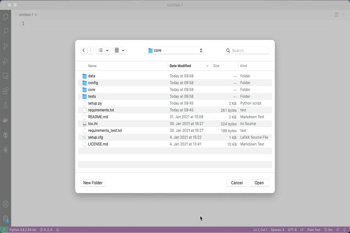

# Photos.network

[Photos.network](https://photos.network) is a privacy first photo storage and sharing service for fediverse.

Its core features are:

- Upload photos and videos without resolution or quality constraints
- Filter / Search photos by attributes like location or date
- Group photos by their content like people or objects
- Share photos with friends, family or public

## Core

This repository contains the **core** system of the project.
It is responsible for main tasks e.g.:

- **Authentication** (validate the identity of users)
- **Authorization** (handle access privileges of resources like photos or albums)
- **Plugin Handling** (extend the feature set by plugins)
- **Persistency** (read / write data)
- **Task Processing** (keep track of running tasks)

## Development

The core is written in [Rust](https://rust-lang.org/) and highly customizably by using a Plugin-system.

### Visual Studio Code

The fastest start into development can be archived by using [Visual Studio Code](https://code.visualstudio.com/) and [Docker](https://www.docker.com/get-started).

1. Install [Docker](https://www.docker.com/get-started)
2. Install [Visual Studio Code](https://code.visualstudio.com/)
3. Install [Visual Studio Code Remote - Containers](https://marketplace.visualstudio.com/items?itemName=ms-vscode-remote.remote-containers)
4. Clone and Open this repository in Visual Studio Code
5. Click the "Reopen in Container" Dialog
6. Launch **Photos.network** from the `RUN` window.

