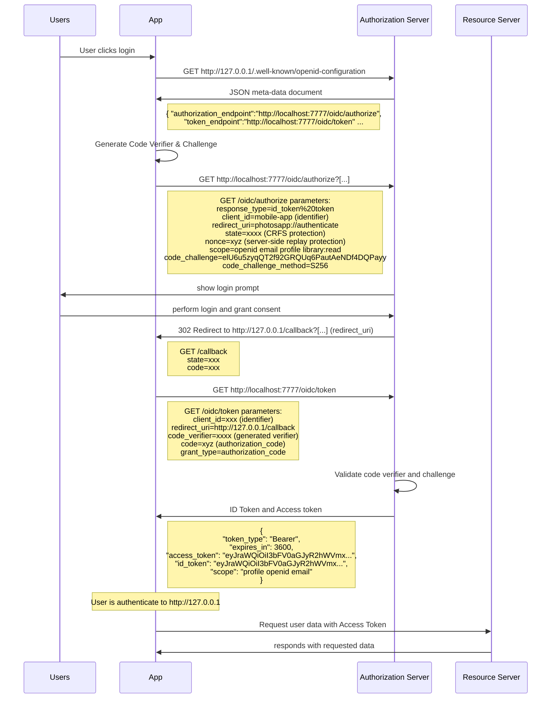

# Authentication

This crate provides an **Authorization code flow with PKCE** for [Photos.network](https://photos.network).

Public clients (e.g. native and single-page applications) cannot securely store client secrets. 

### Native apps
Decompiling the app will reveal the Client Secret, which is bound to the app and is the same for all users and devices. Also they make use of a custom URL scheme to capture redirects (e.g., photosapp://) potentially allowing malicious applications to receive an Authorization Code from your Authorization Server.

### Single-page application
Cannot securely store a Client Secret because their entire source is available to the browser.

With [PKCE](https://datatracker.ietf.org/doc/html/rfc7636) an application created pair of secrets (Code Verifier & Code Challenge) is send to the **authorization server** over HTTPS. This way a malicious attacker can only intercept the Authorization Code but can't exchange it for a token without the Code Verifier.

## Authorization code flow with PKCE

